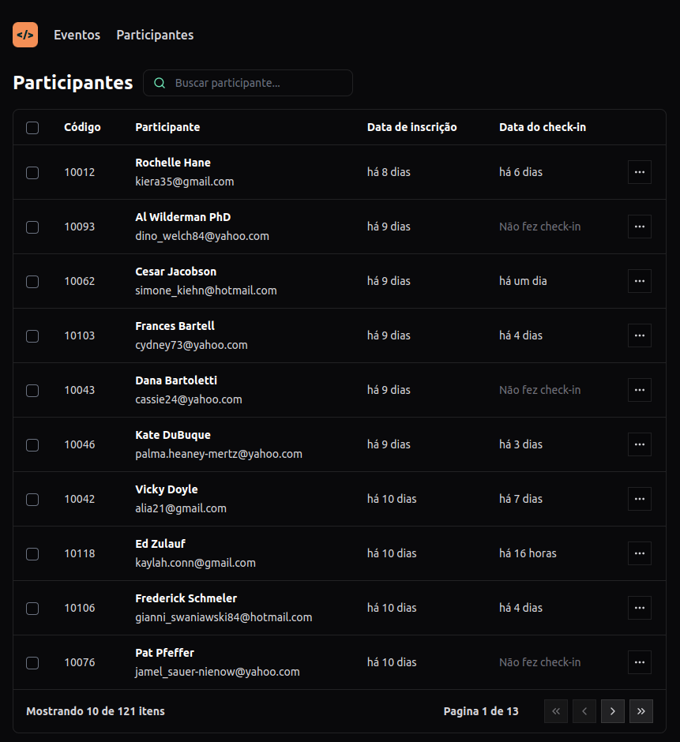

<h1 align="center">Pass In Web</h1>

  Aplicação de controle de participantes em eventos 
   

  <a href="#-tecnologias">Tecnologias</a>&nbsp;&nbsp;&nbsp;|&nbsp;&nbsp;&nbsp;
  <a href="#-projeto">Projeto</a>&nbsp;&nbsp;&nbsp;|&nbsp;&nbsp;&nbsp;
  <a href="#-layout">Layout</a>&nbsp;&nbsp;&nbsp;|&nbsp;&nbsp;&nbsp;
  <a href="#memo-licença">Licença</a>

  

 

  

## 📍 Sobre

Projeto consiste em gerenciar os participantes de um evento onde é possivel verificar os dados pessoais e se o participante realizou o check-in.

## 🚀 Tecnologias

Esse projeto foi desenvolvido com as seguintes tecnologias:

- React Js
- Type Script
- CSS - Tailwind
- Nodejs
- Git e Github
- Figma

## 💻 Usage

1.          Instale as depedencias do NodeJs: npm install
2.          Start a API do servidor nodejs: npm run dev
3.          Start a aplicação pass-in-web: npm run dev

Link do projeto finalizado . -[Visite o projeto online]()

Esse projeto está sob a licença MIT.

---
